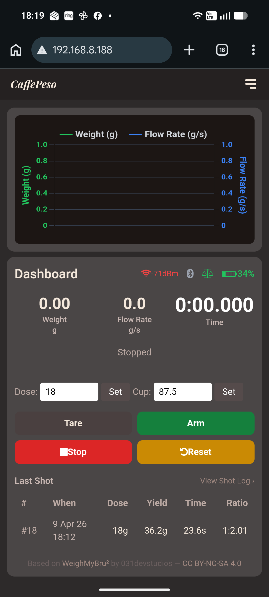
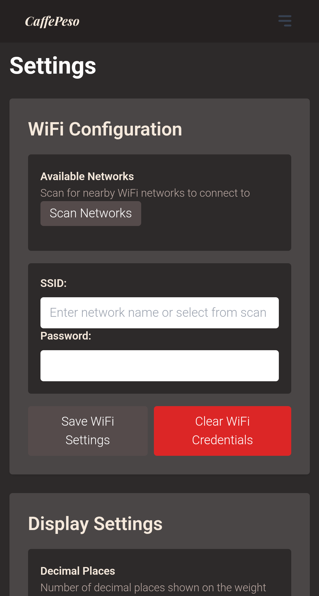
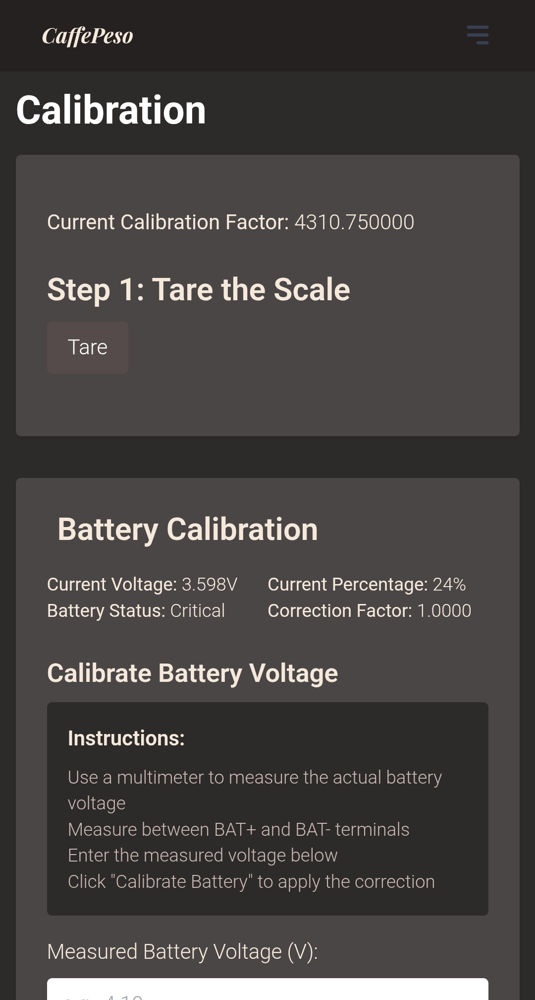
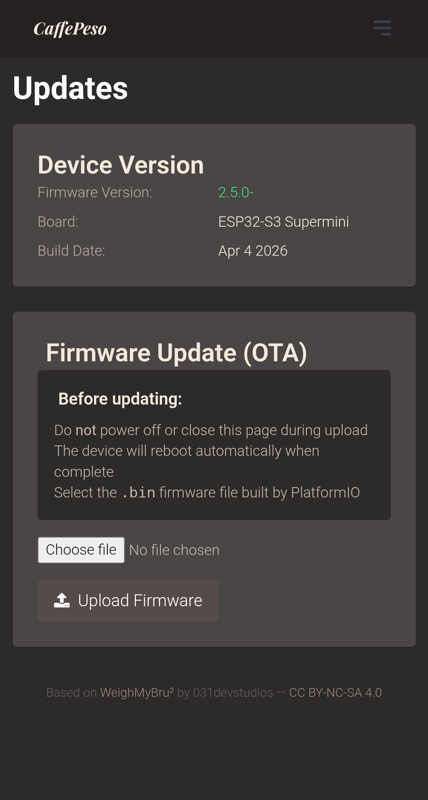
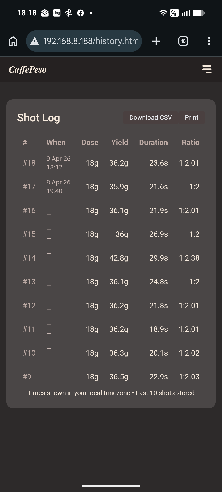

# CaffePeso ☕

> [!NOTE]
> **This project is under active development.** Features and hardware design may evolve.
> Feedback and contributions welcome.

<div align="center">

### *Weigh smarter. Pull better.*


**A smart, automated espresso scale with a web interface — no custom PCBs required.**

Armed auto-start • Auto-stop • Smart switch • Live brew ratio • Shot history • Target yield alert • GaggiMate BLE • Beanconqueror BLE • Wi-Fi web UI

[Features](#-features) • [Hardware](#️-hardware) • [Installation](#-installation) • [Documentation](#-documentation) • [Attribution](#-attribution)


</div>

---

## 📖 What is CaffePeso?

CaffePeso is a fork of [WeighMyBru²](https://github.com/031devstudios/weighmybru2) by 031DevStudios, adding brewing automation to an already excellent DIY espresso scale. It runs on an ESP32-S3 and hosts its own web interface over Wi-Fi — no external server or hub required.

It is designed to work alongside [GaggiMate](https://github.com/jniebuhr/gaggimate) via Bluetooth, or as a standalone scale. Inspired by the [EspressiScale](https://www.espressiscale.com) approach, but built from easily sourceable off-the-shelf parts — no custom PCBs.

---

## 📸 Screenshots

<table>
  <tr>
    <td align="center"><br/><sub>Dashboard</sub></td>
    <td align="center"><br/><sub>Settings</sub></td>
  </tr>
  <tr>
    <td align="center"><br/><sub>Calibration</sub></td>
    <td align="center"><br/><sub>Updates</sub></td>
  </tr>
  <tr>
    <td align="center"><br/><sub>Shot Log</sub></td>
  </tr>
</table>

---

## ✨ Features

### ⏱️ Armed Auto-Start
Hold tare to arm the scale before your shot. The timer starts automatically when the first drip hits the cup — no button press needed at the machine.

### 🔄 Auto-Re-Arm
The scale remembers your cup weight. On the next shot, place the same cup and tap tare — it recognises the cup and arms itself automatically.

### 📊 Live Brew Ratio
Set your dose once. The OLED displays a live 1:X ratio as yield builds in the cup, so you always know where you are in the extraction.

### 🔔 Target Yield Alert
Configure a target ratio (e.g. 1:2.0). When yield approaches your target, the OLED flashes and the web UI turns amber — giving you time to stop the shot.

### 📜 Shot History
The last 10 shots are automatically saved to non-volatile memory: dose, yield, time, and ratio. Survives reboots and power loss. Displayed in the web UI dashboard.

### 📱 Wi-Fi Web Interface
A full dashboard hosted directly on the ESP32-S3 — calibration, settings, shot history, OTA firmware updates, and real-time graphs. No app required.

### 🛑 Auto-Stop on Flow Cessation

Once flow has been active for at least 8 seconds, the timer stops automatically when flow drops below 0.5 g/s and remains there for 2 seconds. No manual stop needed at the end of a shot.

### 🔌 Smart Switch (Shelly Integration)

> **⚠️ Safety notice:** This feature requires fitting a Shelly relay into your machine's mains electrical circuit. This work involves mains voltage and must only be carried out by a competent person who understands the risks. The authors of this project accept no liability for damage, injury, or death arising from electrical work carried out in connection with this feature. **This is entirely optional — CaffePeso is fully functional without it.**

CaffePeso can automatically stop your espresso machine by controlling a [Shelly](https://www.shelly.com) smart relay fitted inline with the pump or solenoid valve. This does require electrical work inside the machine and should only be carried out by a competent person.

When armed with a dose and target ratio, CaffePeso monitors weight and flow rate during the shot and fires a relay-off command when the projected final yield is about to hit the target:

```
trigger = target_weight − (flow_rate × after_stop_time)
```

The **After-Stop Time (AST)** — the seconds of drip after the pump cuts — is learned automatically from each shot and stored per dose/ratio combination, improving accuracy over time.

A **post-trigger safety interlock** keeps the relay off until you perform a hold-tare, preventing the pump accidentally restarting between shots.

See [Section 14 of the User Guide](docs/USER_GUIDE.md#14-smart-switch-shelly-integration) for setup instructions.

### 🔵 Bluetooth Scale Support
Native Bluetooth scale support for [GaggiMate](https://github.com/jniebuhr/gaggimate) and [Beanconqueror](https://beanconqueror.com). CaffePeso uses the same BLE protocol as WeighMyBru² — GaggiMate's existing WeighMyBru support works with CaffePeso without any changes on either side. Beanconqueror can connect to CaffePeso for real-time weight, tare, and timer control.

---

## 🛠️ Hardware

The hardware is identical to the original WeighMyBru² project. See the [original WeighMyBru² repository](https://github.com/031devstudios/weighmybru2) for:
- Bill of Materials (BOM) with purchase links
- Wiring guides and pin assignments
- Enclosure CAD files and print instructions

**Supported boards:**
- ESP32-S3 SuperMini (4 MB flash) — default
- XIAO ESP32S3 (8 MB flash)

---

## 📦 Installation

### 🌐 Web-Based (Recommended)

No software installation required — flash directly from your browser:

1. Visit the [flash page](https://bitbarista.github.io/CaffePeso/flash.html)
2. Connect your ESP32 board via USB
3. Click **Install Firmware** and select your board
4. Follow the prompts

✅ No VS Code or PlatformIO needed
✅ Installs firmware + filesystem in one step
✅ Works on Chrome, Edge, and Opera

### 🔧 PlatformIO (Advanced)

Requires VS Code with the PlatformIO extension.

```bash
# Upload firmware (default: esp32s3-supermini)
pio run --target upload

# Upload filesystem (required for web interface)
pio run --target uploadfs

# For XIAO ESP32S3 explicitly:
pio run -e esp32s3-xiao --target upload
pio run -e esp32s3-xiao --target uploadfs
```

> **Important:** Always flash firmware and filesystem using the same environment. Flashing the wrong environment (e.g. xiao firmware onto a supermini) causes a boot crash due to flash size mismatch (4 MB vs 8 MB).

---

## 📚 Documentation

Full user guide: [docs/USER_GUIDE.md](docs/USER_GUIDE.md)

For hardware build guides and video walkthroughs, see the [original project](https://github.com/031devstudios/weighmybru2).

---

## 🤝 Contributing

Contributions welcome — bug fixes, features, and documentation improvements are all appreciated. Please test your changes before submitting a pull request.

---

## 📜 Attribution

This project is a derivative of [WeighMyBru²](https://github.com/031devstudios/weighmybru2) by 031devstudios, licensed under [CC BY-NC-SA 4.0](https://creativecommons.org/licenses/by-nc-sa/4.0/).

Additions in this fork:
- CaffePeso branding — dark warm-brown web UI theme, Playfair Display italic title, OLED splash
- Armed auto-start: hold tare to arm; timer triggers on first drip; auto-re-arms when same cup detected
- Live OLED brew ratio during extraction
- Target yield alert: OLED flashes and web UI turns amber when approaching target ratio
- Cup weight persistence across reboots (NVS)
- Shot history: last 10 shots stored in NVS, displayed in web UI
- Power button redesigned: tap cycles timer (start → pause → reset); hold 1 s = status page; hold 3 s = sleep
- Wi-Fi always-on: toggle removed; device deep-sleeps to save power instead
- Auto-stop on flow cessation: timer stops automatically when espresso flow ends
- Auto-tare on vessel placement: tares automatically when a stable weight is detected (configurable threshold)
- Post-brew idle reset: auto-resets and re-tares after a configurable idle period
- Arm button in web UI: arm/disarm directly from the dashboard without touching the physical button
- Smart switch: predictive Shelly relay control to stop the machine at target yield, with per-dose AST learning and post-trigger safety interlock

This derivative is also released under [CC BY-NC-SA 4.0](https://creativecommons.org/licenses/by-nc-sa/4.0/).

---

## ⚖️ Disclaimer

This project is provided "AS IS" without warranty of any kind. The author makes no representations about suitability, reliability, or fitness for any purpose. Your use is entirely at your own risk. The author shall not be liable for any damages arising from use, including but not limited to direct, indirect, incidental, or consequential damages.

---

## 🙏 Acknowledgments

- **[WeighMyBru²](https://github.com/031devstudios/weighmybru2)** by 031devstudios — the hardware design and original firmware this project is built on (CC BY-NC-SA 4.0)
- **[GaggiMate](https://github.com/jniebuhr/gaggimate)** by jniebuhr — for native BLE scale support
- **[EspressiScale](https://www.espressiscale.com)** — inspiration for the approach

---

<div align="center">

**Built with ☕ by a home espresso enthusiast**

*Not affiliated with any espresso machine manufacturer*

</div>
